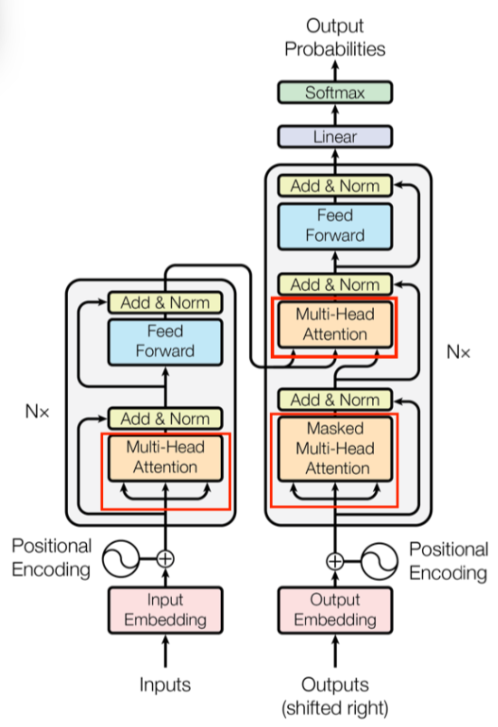
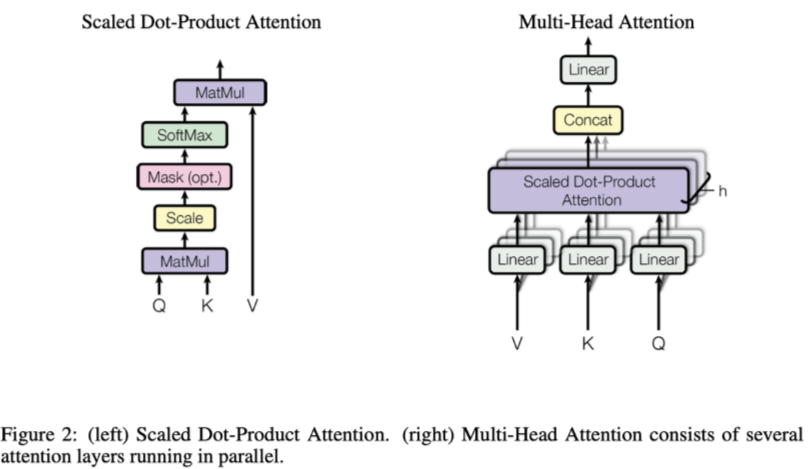
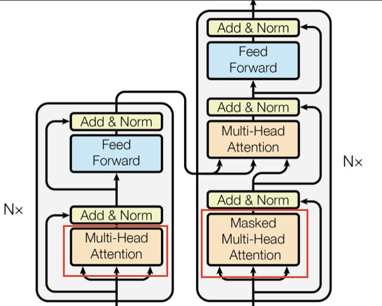

## LLM中的注意力机制
### 1.一句话看透本质
Attention 计算的本质是通过点积来衡量査询和键之间的相关性并进行加权汇总，以聚焦于重要语义信息,这一部分的技术主要是指以下这些部分，由于输入的不同，会分为self-attention和cross-attention:

### 2.为什么需要 Attention?
在自然语言处理、序列建模等任务中，输入往往是变长序列:如文本、音频或视频帧序列等。传统的 RNN(如 LSTM、GRU)等方法，在处理较长序列时，会面临 梯度消失 或 梯度爆炸，同时由于循环结构本身的限制，模型难以灵活地在不同位置之间建立直接的、可控的依赖关系。
**Attention(注意力机制)**的引入，核心动机是让模型在处理当前时间步(或当前词)时，可以**自适应地关注**输入序列中更重要的部分，忽略不重要的部分。它通过显式地计算每个位置之间的相关性(相似度)，并据此加权求和来获取上下文信息，从而达到了更好的表示效果。
在机器翻译、文本摘要、阅读理解等场景中，**不同时刻**对于输入序列不同位置的信息需求是不同的。Attention 机制能让模型动态地分配"注意力权重”，使得在当前生成某个词时能够侧重参考输入序列的相应语义部分。相比纯RNN/CNN，这种机制在捕捉长距离依赖方面表现更出色。

### 3.Scaled Dot-Product Attention 的基本计算步骤

我们以最基础的（加性或点积）Attention为例，在Transformer里最常见的是**Scaled Dot-Product Attention**：
1. 准备 Q, K, V：
   - **Q (Query)**：通常是“查询”，它可以是**当前解码位置的隐藏向量**，也可以是**输入序列中某个位置的表示**等，具体要看任务以及所处的模块（如 self-attention, cross-attention）。
   - **K (Key)**：表示所有输入向量的“索引”或“特征”，用于匹配 Q。K 帮助模型找到与 Q 相关的内容。
   - **V (Value)**：Value向量与Key向量对应，它们表示参考序列中每个位置的实际信息或内容。

总的来说，Q（Query）：当前需要处理的信息或上下文。K（Key）：参考序列中每个位置的表示，用于与Query匹配。
V（Value）：参考序列中每个位置的实际信息，根据Query与Key的匹配程度被提取。

2. 计算注意力得分（score）：
   常见做法是点积 score(Q, K_i) = Q · K_i 或者 “加性加权” 等方式。
   Transformer 提出的 “缩放点积” 做法即 score(Q, K_i) = \(\frac{Q \cdot K_i}{\sqrt{d_k}}\)。
   这里的归一化系数 \(1/\sqrt{d_k}\) ，它本身是Key向量的维度。用来防止内积值过大，减缓梯度问题，原因如下：
   > 当向量维度很高时，点积的值很容易变得非常大，这会导致后续的softmax操作产生问题（比如梯度消失或梯度爆炸）。

3. 用softmax获得注意力权重：\(\alpha_i = \text{softmax}(\text{score}(Q, K))\)
   这样得到一组归一化系数 \(\alpha_i\)，表示对参考序列各个位置信息的关注度。

4. 加权求和：
   \[
   \text{Attention}(Q, K, V) = \sum_i \alpha_i \cdot V_i
   \]
   这个输出向量可以视作对序列信息的“摘要”或“上下文表示”。
   在公式层面，Scaled Dot-Product Attention一般会写成：
   \[
   \text{Attention}(Q, K, V) = \text{softmax}\left(\frac{QK^T}{\sqrt{d_k}}\right)V
   \]

#### 例子：（非普遍，具体看用的什么类型的Attention）
想象一下，你在图书馆里找书。你手里有一本书的简介（Query），你想找到和它最匹配的书。

- **点积**：你可能会看每本书的目录（Key），然后和你手里的简介做比较。如果两本书的内容很相似，你会觉得它们很“匹配”。这就是“点积”的概念，它衡量两本书的相似度。

- **缩放点积**：但是，如果你的图书馆非常大，书的目录（Key）可能非常长（维度高）。直接比较可能会让相似度得分变得非常大，这就像在一个大图书馆里，相似的书可能会被认为“过于相似”。为了避免这种情况，我们用一个小技巧：把相似度得分除以一个数（通常是目录长度的平方根），这样得分就不会变得太大。这就是“缩放点积”。

- **softmax函数**：现在，你手里有一堆书，每本书都有一个相似度得分。你需要决定哪些书最值得一看。你可能会根据得分给每本书一个“关注度”分数，这个分数表示你有多想看这本书。这就是softmax函数的作用，它把相似度得分转换成关注度概率。

- **归一化系数**：这样，你就可以确保所有书的关注度加起来等于100%，这样你就可以公平地分配你的注意力。

- **加权求和**：最后，你可能会根据每本书的关注度来决定你最终要看的书的内容。这就是“加权求和”。你把每本书的内容（Value）按照关注度分数加权，得到一个综合的内容摘要。

- **输出向量**：这个摘要就像是你对所有相关书的综合理解，它包含了所有书的精华信息。

### 4.Attention 与 传统 Seq2Seq 模型的区别
- 传统的 **Seq2Seq(基于 RNN 编码器-解码器)** 在解码时只使用编码器最终时刻的隐藏状态来代表整句信息，容易丢失句子中间的重要细节，尤其对长序列不友好。
- Attention 则可以在解码器生成每个词时动态地查看编码器输出的**所有隐藏状态**，并计算**哪部分更重要**，从而让解码器在各个时刻都能与整个输入序列进行交互。

### 5.Self-Attention 和 Cross-Attention的区别（重要）

假设你输入一段文本，LLM 先将其转化为词嵌入（word embeddings），然后加上位置编码，得到一个初始向量序列（比如 [x1, x2, x3, ...]）。

#### 5.1Self-Attention 过程：
**1.利用线性变换生成QKV：**
假设你输入一个句子“猫在树上”，经过词嵌入和位置编码后，得到一个向量序列：
[x1, x2, x3]，分别对应“猫”、“在”、“树上”。
每个 xi 是一个 d 维向量（比如 d=512），包含词义和位置信息。对于每个向量 xi，分别通过三个权重矩阵 W_Q、W_K、W_V 进行线性变换，生成对应的 Q、K、V。即：
Q1 = x1 * W_Q，K1 = x1 * W_K，V1 = x1 * W_V
Q2 = x2 * W_Q，K2 = x2 * W_K，V2 = x2 * W_V
Q3 = x3 * W_Q，K3 = x3 * W_K，V3 = x3 * W_V
这样，序列 [x1, x2, x3] 会生成 [Q1, Q2, Q3]、[K1, K2, K3]、[V1, V2, V3]。

**2.定义：** 
自注意力机制用于处理同一个序列中的元素之间的关系。在一个序列中，内部建模各个位置之间的依赖关系。在Transformer模型的编码器/解码器中，对同一个序列进行Q（Query）、K（Key）、V（Value）的计算，这就是自注意力。能够捕捉序列内部任意两个位置之间的直接交互，无需循环地逐步传播信息。

**2.注意力计算：**
对每个 Qi，计算它与所有 Kj 的相似度（通常是点积 Qi · Kj），得到一个分数矩阵。比如：
Q1 与 [K1, K2, K3] 的点积，得到 [score(Q1,K1), score(Q1,K2), score(Q1,K3)]，这些分数经过 softmax 归一化，变成注意力权重，表示 Q1 关注 K1, K2, K3 的程度。最后，用这些权重加权对应的 Vj，得到输出。例如，x1 的新表示 z1 = softmax([Q1·K1, Q1·K2, Q1·K3]) * [V1, V2, V3]。

#### 5.2Cross-Attention 过程：
**1.定义：** 
定义：交叉注意力机制用于处理不同序列之间的关系。
应用场景：在翻译等任务中，解码器需要对编码器输出序列进行检索或对齐，将解码器当前时刻的隐藏向量作为Q，编码器输出作为K和V，这就是交叉注意力。
功能：让解码器在生成目标语言的词时，可以“跨序列”查看源语言的表示，以捕捉源语句哪个位置最相关。

**2.注意力计算：**
Q（Query）查询：表示当前位置需要关注的信息。在**自注意力**中，Q是当前序列中的位置；在**交叉注意力**中，Q是解码器当前时刻的隐藏状态。
K（Key）键：表示序列中其他位置的信息。在自注意力中，K是同一序列中的位置；在交叉注意力中，K是编码器输出的序列。
V（Value）值：表示与键（Key）对应的实际信息或特征。在自注意力中，V是同一序列中的位置；在交叉注意力中，V是编码器输出的序列。
计算过程一样的，就是Q的定义不一样。

**区别：** 
自注意力的深入：
自注意力机制通过计算序列中每个元素与其他元素的关系，能够捕捉长距离依赖关系。
在Transformer模型中，自注意力机制通过并行计算，提高了模型的计算效率。
交叉注意力的深入：
交叉注意力机制通过将解码器的当前状态与编码器的输出进行对齐，能够更好地捕捉源语言和目标语言之间的对应关系。
在翻译任务中，交叉注意力机制使得解码器能够根据当前生成的词，动态地从编码器的输出中选择最相关的信息。

### 6.主流的 Attention 方法

1. **Scaled Dot-Product Attention**
   - 由 Q, K, V 线性变换后再做“点积 + softmax + 加权求和”计算，是最常见也是最核心的一种注意力形式。

2. **Multi-Head Attention (MHA)**
   - 将 Q, K, V 分为 \( h \) 个子空间（头），并行计算注意力，然后再拼接（concat）起来再投影。
   - 好处：让模型在不同子空间上学习到不同类型的关注模式，提升模型表现。
   - 参考代码 MHA.py 和 MQA.py

3. **Relative Positional Encoding / Transformer-XL**
   - 注意力本身不带位置信息，需要配合位置编码；也可以在注意力中显式引入相对位置关系（如 Transformer-XL、T5 的相对位置偏置）。

4. **长序列注意力变体**
   - 如 Transformer-XL、Longformer、BigBird等，专门为处理很长的序列而在注意力计算或结构上进行改进，减少内存和计算开销。

### 1.1.4.7. 在计算时如何对 Padding 做 Mask?

对于有 padding 的序列（如批量训练时把短序列补到同样长度），我们需要在注意力计算的 softmax 之前，对 padding 位对应的得分位置添加一个极大的负数（如负无穷），从而让 softmax 结果在这些位置趋近于 0，彻底屏蔽掉无效位的影响。