### 1.ReDeEP: Detecting Hallucination in Retrieval Augmented Generation via Mechanistic Interpretability
**信息：** 中国人民大学高瓴人工智能学院
**方向：** RAG幻觉的可解释性
**评价：** 很屌

### 2.背景
1. 如图1所示，RAG在检索文档 + 模型自身参数知识时，模型可能回答错误。如第二张图所示。
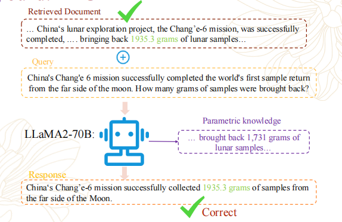
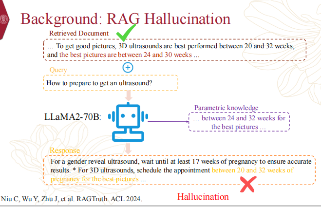
2. 最近的研究考察了外部知识与LLM对RAG的参数化知识之间的冲突。但之前地工作并没有深层次地揭示冲突和幻觉之间的联系。
作者将外部知识E和内部参数P分开来分析对幻觉的影响：
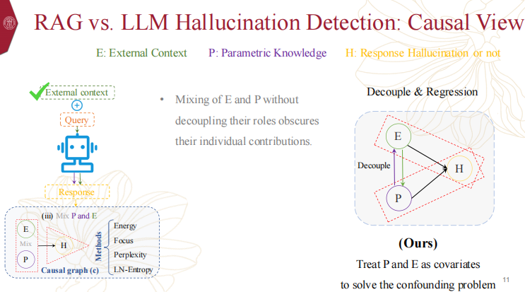

3. 那么如何分析呢？作者首先基于一个发现：
将第n个token在L层的隐藏状态进行分解，为前l-1个token的隐藏状态在**attention**的计算和**前向传播**的计算，最后的xn是一个残差，乘以矩阵Wu是为了将最后的隐藏状态映射到词表上。
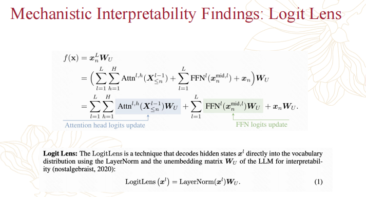

### 3.分析
作者定义了一种外部知识的计算方式ECS，计算最后一个token对之前token的注意力分数来判断注意力层、头是否关注外部知识（Step1）；然后将L层输出后的外部知识隐藏状态进行池化，以表示对外部知识整体关注程度，将最后一个token的隐藏状态和外部知识隐藏状态计算相似度，以表示模型在生成时是否利用了外部知识。
- 作者发现注意头正确地注意到外部环境，但幻觉经常发生。
- LLM 在生成过程中是否有效地保留和利用了来自外部上下文的这些信息。
- 个人认为作者想表达的意思是 “生成时关注了外部知识，但是不一定有采用”。
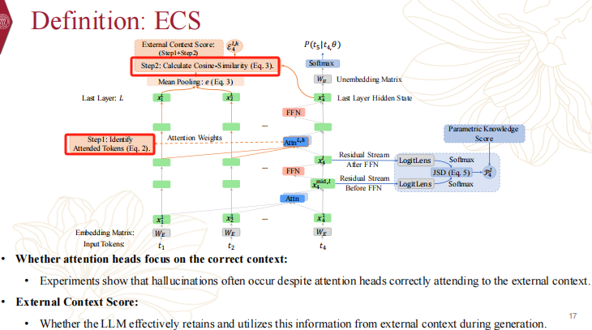

PKS为计算模型生成时，跟内部参数有关的程度，具体思路跟ECS一样。
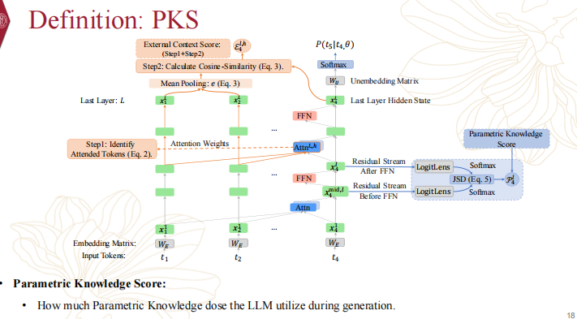

### 4.实证研究
作者主要考虑了3点
- 外部语知识、内部参数和幻觉的关系。
- 作者从因果角度验证了以上关系的存在。
- 从外部知识和内部知识的参数化分析了幻觉行为。
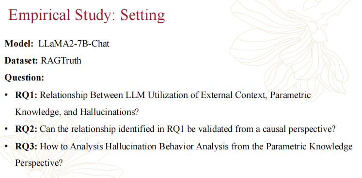

### 5.分析
首先作者分析了ECS和幻觉的关系：
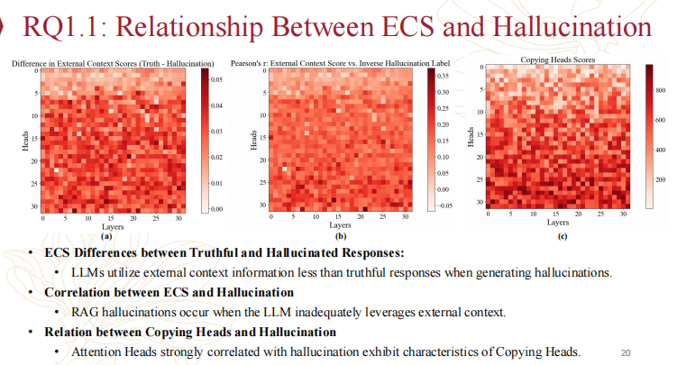

可以发现幻觉反应的ECS关系
- 模型在产生幻觉时利用外部情境信息少于真实反应。
- ECS与幻觉之间的相关性
- 当模型没有充分利用外部环境时，就会出现RAG幻觉。
- 复制头与幻觉之间的关系
- 与幻觉密切相关的注意头表现出模仿头的特征

然后分析了PKS和幻觉之间的关系：
- 坐标轴定义，横坐标（Layers）：模型的层数（从第 1 层到第 30 层左右 ），体现信息处理的深度。纵坐标（Difference in Parametric Knowledge Scores）：幻觉回复的 PKS 减去真实回复的 PKS 的差值 → 差值 ＞0 表示 “该层幻觉回复的 PKS 更高”；＜0 表示 “真实回复的 PKS 更高”。深层（如 15 - 30 层 ）差异更显著 → 模型深层更依赖 “参数知识” 时，更容易产生幻觉。
- 结论，在所有层中，幻觉回复的 PKS 普遍高于真实回复（平均值为 1.27，红色虚线标注 ）。
- 右图，模型深层（尤其是 FFN 模块）的 PKS 与幻觉呈正相关（系数越高，幻觉可能性越大 ），浅层（如 1 - 15 层 ）相关性弱，深层（如 20 - 30 层 ）相关性强 → 深层过度依赖参数知识，会增加幻觉风险。
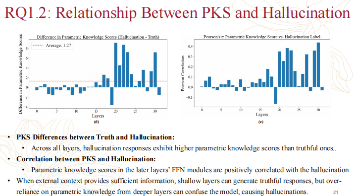
作者发现外部上下文充足时，浅层能生成真实回复；但layer深层过度依赖参数知识，会让模型 “混淆事实”，最终产生幻觉。

然后进行了因果分析：
作者假设，对注意力头和 FFNs 进行特定干预后，是否会显著影响模型的预测损失？
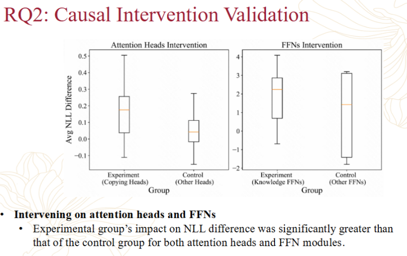
这张图通过因果干预实验，验证了特定注意力头和 FFNs 在模型知识处理中的核心作用 —— 干预这些模块，会显著影响模型预测结果，说明它们是模型知识利用的 “关键组件”。

### 6.方法
作者提出了两种方法缓解幻觉现象的发生：
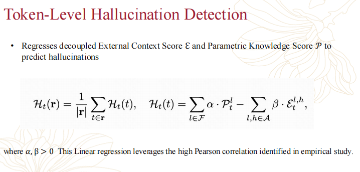
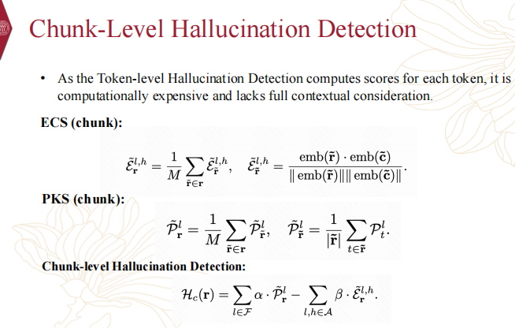