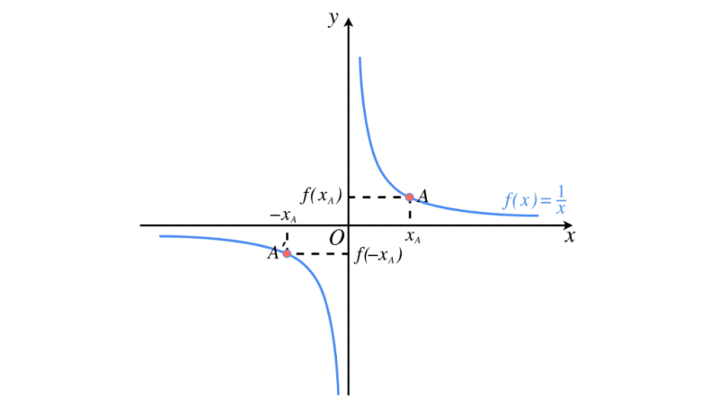

## LLM的超参数
### 1. Temperature（温度）
**定义：** Temperature 是一个控制模型输出多样性的参数。它决定了模型在生成文本时选择下一个词的概率分布的“平滑程度”。
**作用机制：** 
- 当 temperature = 0 时，模型会始终选择概率最高的词作为下一个词，生成的结果非常确定和可预测，但可能会缺乏多样性。
- 当 temperature > 0 时，模型会根据温度值调整概率分布。温度值越高，概率分布越“平滑”，模型选择非最高概率词的可能性越大，生成的结果越多样化，但也可能更偏离常规。
- 例如，假设下一个词的概率分布是：A（0.9）、B（0.05）、C（0.05）。如果 temperature = 0，模型会一直选择 A；如果 temperature = 1.0，模型会按照原始概率选择；如果 temperature = 2.0，模型选择 B 和 C 的概率会增加，生成的结果会更“随机”。
**Temperature是怎么算的？**

温度（temperature）是通过对概率分布进行“拉伸”或“压缩”来改变选择下一个词的概率的（想象成一个概率分布）。具体来说，它是通过将每个概率值除以温度值的指数来实现的。公式如下：

\[ P_{\text{adjusted}}(x) = \frac{P(x)^{\frac{1}{\text{temperature}}}}{\sum P(x)^{\frac{1}{\text{temperature}}}} \]

其中：
- \( P(x) \) 是原始概率。
- \( \text{temperature} \) 是温度值。
- \( P_{\text{adjusted}}(x) \) 是调整后的概率。

假设下一个词的概率分布是：A（0.9）、B（0.05）、C（0.05）。

- 当 temperature = 0 时
实际上，temperature 不能真正等于 0，因为这会导致除以 0 的情况。但当 temperature 极其接近 0 时，概率分布会变得非常极端，几乎相当于只选择概率最高的词。此时，模型会几乎总是选择 A。

- 当 temperature = 1.0 时
此时，调整后的概率就是原始概率。因为当 temperature = 1 时，公式中的指数部分为 1，不会改变概率值。

A：\( \frac{0.9^{1}}{0.9^{1} + 0.05^{1} + 0.05^{1}} = \frac{0.9}{0.9 + 0.05 + 0.05} = \frac{0.9}{1} = 0.9 \)
B：\( \frac{0.05^{1}}{0.9^{1} + 0.05^{1} + 0.05^{1}} = \frac{0.05}{1} = 0.05 \)
C：\( \frac{0.05^{1}}{0.9^{1} + 0.05^{1} + 0.05^{1}} = \frac{0.05}{1} = 0.05 \)

所以，模型会按照原始的概率分布来选择词。

- 当 temperature = 2.0 时
此时，每个概率值都会被提升到 \( \frac{1}{2} \) 的次方。

A：\( \frac{0.9^{\frac{1}{2}}}{0.9^{\frac{1}{2}} + 0.05^{\frac{1}{2}} + 0.05^{\frac{1}{2}}} = \frac{0.95}{0.95 + 0.2236 + 0.2236} = \frac{0.95}{1.4} \approx 0.68 \)
B：\( \frac{0.05^{\frac{1}{2}}}{0.9^{\frac{1}{2}} + 0.05^{\frac{1}{2}} + 0.05^{\frac{1}{2}}} = \frac{0.2236}{1.4} \approx 0.16 \)
C：\( \frac{0.05^{\frac{1}{2}}}{0.9^{\frac{1}{2}} + 0.05^{\frac{1}{2}} + 0.05^{\frac{1}{2}}} = \frac{0.2236}{1.4} \approx 0.16 \)

可以看到，A 的概率从 0.9 降低到了约 0.68，而 B 和 C 的概率从 0.05 分别增加到了约 0.16。这使得模型选择 B 和 C 的概率相对原始概率分布有了显著增加，从而使得生成的结果更“随机”。

**直观理解：**
- 当 temperature = 1.0 时，模型按照原始概率分布选择词。
- 当 temperature > 1.0 时，模型会“拉平”概率分布，让低概率词的选择概率相对增加，使生成结果更多样化。
- 当 temperature < 1.0 时，模型会“压缩”概率分布，让高概率词的选择概率相对增加，使生成结果更集中于高概率词。

**发现：**
- 在概率为0.5时，如果t=2，那么0.5的1/2次方为0.7，涨幅为原来的1.4倍；
- 如果概率>0.5，比如0.9，如果t=2，涨幅值为原来1.05倍；
- 也就是说当 t>1 时，越小的概率值放大的程度就会越大，而越大的概率值放大程度就会越小；
- 因此，token_A 的概率如果很大的话，t设置越大(t>1)，其他token的概率值放大程度就会越大，而自己放大程度变小，因此最后token_A 的概率就会变小；
- 相反，如果我们想放大大值token的概率，我们可以将temperature设置到0-1，1是不变，如果在0-1之间，由于大的概率的指数>1（1/x，x∈(0,1)），所以大的token概率缩小程度会小很多，比如：
- 1/temperature = 3，token_a = 0.9，那么计算后的概率为：0.729，缩小的幅度为原来的0.81，如果token_b = 0.3，那么计算后的概率为0.027，缩小的幅度变为原来的0.09；
- 好，现在我们发现了temperature的变化所带来的影响，即t = 1的时候，token概率不变；t > 1的时候，越大的概率重要程度会越小，越小的重要程度会变大；当 t < 1时候，则相反；
- 我们迁移到attention上，如果我们将重要的核心内容（名词、动词）优先输出到模型输出的首部，那么这部分的attention是最高的，但是随着输出的内容越来越多，这部分重要token的注意力会越来越弱，那我们如何使得他们的注意力变化削弱的缓慢呢？我们可以利用这个temperature的思路，使得attention大的token变化慢，attention小的token变化快。

### 2. Top-P（累积概率）
**定义：** Top-P 是一个控制模型输出多样性的参数，它限制了模型在生成文本时只从概率累积达到 P 的词汇中选择下一个词。
**作用机制：**
模型会计算下一个词的概率分布，并按照概率从高到低排序。
然后从概率最高的词开始累加，直到累加的概率达到 P，只从这些词中选择下一个词。
例如，假设下一个词的概率分布是：A（0.5）、B（0.3）、C（0.1）、D（0.1）。如果 top_p = 0.8，那么模型只会从 A 和 B 中选择下一个词，因为 A 和 B 的概率之和为 0.8，达到了设定的 P 值。
当 top_p = 1.0 时，模型会考虑所有可能的词，与不使用 top_p 限制的效果相同。
当 top_p < 1.0 时，模型的输出会更倾向于选择高概率的词，生成的结果更可预测，但可能会牺牲一些多样性。
**应用场景：**
在需要生成较为稳定、可靠文本的场景（如新闻报道、学术写作）中，可以将 top_p 设置得较低，以确保生成的文本符合常见的语言模式。

### 3. Top-K（固定数量）
**定义：** Top-K 是一个控制模型输出多样性的参数，它限制了模型在生成文本时只从概率最高的 K 个词中选择下一个词。
**作用机制：**
模型会计算下一个词的概率分布，并按照概率从高到低排序。
然后只从概率最高的 K 个词中选择下一个词。
例如，假设下一个词的概率分布是：A（0.5）、B（0.3）、C（0.1）、D（0.1）。如果 top_k = 2，那么模型只会从 A 和 B 中选择下一个词。
当 top_k = 0 时，模型会考虑所有可能的词，与不使用 top_k 限制的效果相同。
当 top_k > 0 时，模型的输出会更倾向于选择高概率的词，生成的结果更可预测，但可能会牺牲一些多样性。

### 代码
详见 temperature.py、top-k.py、top-p.py