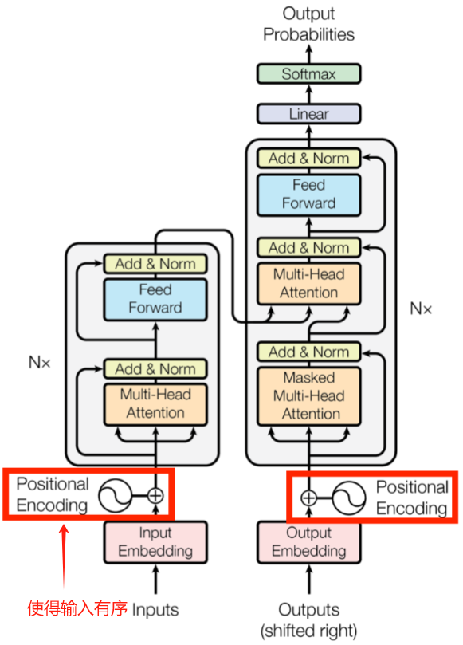
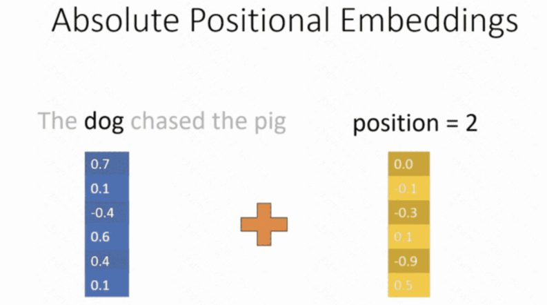
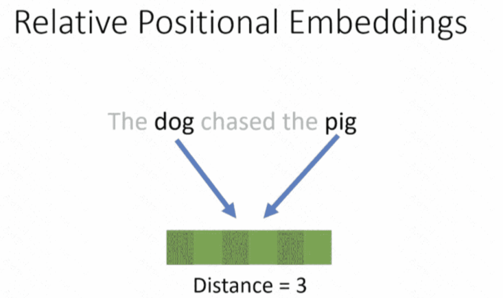
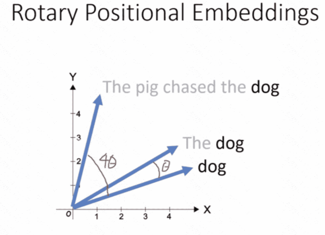
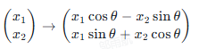

-# 位置编码 Position Encoding
## 1.介绍
由于 Transformer 中使用的**自注意力机制（Self-Attention）**不存在顺序这一概念，因此在自注意力机制之前需要加一个机制，能够包含对输入位置信息的理解。

以下笔记内容将从零开始，讲解 Transformer 模型中位置编码(Positional Encoding)的作用、意义以及主流的实现方法，包括各自的公式与应用场景。

## 2.为什么需要位置编码？
### 2.1自注意力机制的“无序特征”
- RNN：一次只接收一个时刻的输入，顺序地从左到右（或右到左）处理，这就天然地包括了序列顺序的信息。（按顺序一个一个处理的，自带“时间”概念。）
- CNN：过卷积核在局部范围进行扫描，也能保留相对顺序或位置信息。（卷积核在局部滑动，有“位置”的概念。）
> 这种顺序性是一种**归纳偏置（inductive bias）**, 归纳偏置是指在没有足够数据的情况下，模型在训练过程中对数据分布的一种先验假设（CNN的位置和RNN的时间），即数据是怎么分布的，谁第一个谁第二个。简单来说，模型在学习时默认的“先验信念”。这种偏置帮助模型在面对不完整信息时做出更靠谱的推理。

然而，Transformer 中使用的 自注意力机制(Self-Attention)并没有内在的顺序概念。它在计算attention时可以并行地关注序列中任意位置的词或符号，而不会像 RNN 那样严格按照时间步展开，也不像 CNN 那样局部扫描，也就是说，**自注意力机制是与位置无关的**。

### 2.2保留序列位置信息的必要性
**动机：** 在自然语言处理任务(如机器翻译、文本生成等)或其他序列任务(如时间序列分析等)中，词或特征的**出现顺序**往往至关重要。例如句子"我爱你“和"你爱我"尽管包含了相同的词，但它们含义完全不同。如果不显式地告诉模型 "第一个 token 是谁，第二个 token 是谁，第三个 token 是谁.."，模型在进行自注意力时就无法利用序列顺序信息。

**结论：** 因此，在 Transformer 中引入一个位置编码(Positional Encoding)，用来在特征表示中标记每个 token 在序列中所处位置的信息。

## 3.位置编码的基本概念
位置编码(Positional Encoding)就是给每个输入 token(或符号)添加一个向量，用来表示其在序列中的位置(或顺顺序)。
- 这个向量可以看作是一种信号，与 token 的词向量或特征向量相加或拼接在一起，从而让后续的自注意力机制知道每个 token 的位置信息。
- 对于常见的 Transformer 实现来说，位置编码的维度与词向量的维度相同，这样可以直接与词向量做相加操作，不用额外增加模型的层数或参数维度。
**主流方法：**
1. 绝对位置编码（Absolute Positional Encoding）
    - 固定的正余弦位置编码（Sinusoidal Positional Encoding）
    - 可学习得位置编码（Learnable Positional Encoding）
2. 相对位置编码（Relative Positional Encoding）
    - 旋转位置编码（Rotary Position Encoding，RoPE）
    - ALiBi（Attention with Linear Biases）

## 4.固定的正余弦位置编码(Sinusoidal Positional Encoding)
-属于绝对位置编码
**1.介绍：** 
这是 **《Attention Is All You Need》** 论文中提出的经典方法。他们并没有选择让位置编码成为可训练的参数而是设计了一套基于正弦和余弦函数的确定性计算方法。这样做的好处是:
- 如果序列长度在训练时没见过，模型依然可以通过插值或外推的方式，保持同样的正弦和余弦规律，从而处理比训练时更长的序列。
- 与可学习的嵌入相比，不会额外引入大量可训练参数。


**问题1：为什么要保留正弦和余弦规律？**
> **1.周期性：** 因此正弦和余弦是周期性的，能够通过这种周期性合理地预测编码，使得编码也具有规律性，这样在预测新位置的编码时，哪怕输入序列长度超过了训练时见过的最大长度，模型仍然能够生成新的位置的编码。这样就能利用周期性很好地帮助模型捕捉元素相对位置信息。
> **2.平滑性：** 由于位置编码的变化是平滑的，模型可以更容易地推断出下一个位置的编码，从而更准确地预测下一个元素的值。（下一个编码预测是有迹可循的，如果不平滑的话就很难保证下一个编码是有意义的）
> **3.无额外训练参数：** 所有参数均是按照固定公式生成，不会额外增加可学习的权重。

**问题2：什么叫插值和外推？**
> **插值（Interpolation）：** 插值是在已知数据点之间估计未知数据点的方法。在位置编码中，这意味着如果模型需要处理一个比训练时见过的序列更长的序列，它可以在已知的位置编码之间进行插值来估计新位置的编码。假设你有一组数据点 (1,2) 和 (3,6)。如果你想要估计 x=2 时的 y 值，你可以使用线性插值来找到这个值。线性插值假设 y 值在 x=1 和 x=3 之间线性变化，因此 y 值在 x=2 时应该是 4。(在已知数据点范围内容进行估计，即已知点是连续的，并遵顼某种模式（线性、多项式等）)
> **外推（Extrapolation）：** 外推是在已知数据点之外估计未知数据点的方法。在位置编码中，这意味着如果模型需要处理一个比训练时见过的序列更长的序列，它可以在已知的位置编码之外进行外推来估计新位置的编码。例如，如果你想要估计 x=4 时的 y 值，你将需要进行外推。假设 y 值在 x=1 和 x=3 之间线性变化，那么 y 值在 x=4 时应该是 8。然而，这种假设可能在 x=3 之后可能不成立，但适用于周期性函数。——>适合解决训练数据长度之外的编码。

**2.公式：**
假设词向量或隐藏向量的维度是 \(d_{\text{model}}\)，那么对于第 \(position\) 个 token（从 0 开始计数），其位置编码向量可以表示为：

\[ PE(position, 2i) = \sin\left(\frac{position}{10000^{\frac{2i}{d_{\text{model}}}}}\right) \]

\[ PE(position, 2i + 1) = \cos\left(\frac{position}{10000^{\frac{2i}{d_{\text{model}}}}}\right) \]

- 其中 \(i\) 表示维度索引中“偶数”或“奇数”的一半，通常我们把维度从 0 到 \(d_{\text{model}} - 1\) 分为偶数维和奇数维。
- 在偶数维（即维度 0, 2, 4...），使用正弦函数；在奇数维（即维度 1, 3, 5...），使用余弦函数。
- 这个公式中的分母 \(10000^{\frac{2i}{d_{\text{model}}}}\) 的作用是控制不同维度上正弦/余弦周期的跨度，从而使得不同维度编码了不同的频率。**（即2i+1表示余弦，因为奇数，2i表示正弦，因为偶数，保证每个维度都能触发正弦/余弦）**
- 10000的选择：基于经验性考虑的。在Transformer模型的原始论文中，作者通过实验发现，使用 10000 作为基数可以取得良好的效果，因此将其作为默认值。（可能跟编码变化更加平滑、避免周期重叠有关，因为序列长度通常不会超过10000，保证每个编码都是唯一的）

**使用方式：** 在大多数实现中，生成的正余弦位置编码和 token 的词向量相加的方式输入到Transformer 的第一层以及后续各层的多头自注意力模块中。

## 5.可学习的位置编码(Learnable Positional Encoding)
-属于绝对位置编码
**1.介绍：** 如果我们允许位置编码在训练的过程中进行"学习"，那么就像词向量(word embedding)一样，模型可以自己通:训练数据来决定如何在不同的维度上表示位置信息。这个方法相比正余弦公式更加灵活，但也有一些潜在问题,例如:
- 训练可能需要更多数据，才能覆盖更长的序列范围。（因此对模型的泛化能力会有影响）
- 如果需要处理的序列长度超过训练时的最大长度，模型对超长序列的位置索引就没法很好地"外推"（因为该方式不同于正余弦函数那种周期性的方式）。

**2.具体实现：** 
- 通常会初始化一个矩阵 \( P \in \mathbb{R}^{L_{\text{max}} \times d_{\text{model}}} \)，其中 \( L_{\text{max}} \) 表示预先设定的最大序列长度。（也就是代码中的 Seq_len）
- 对于序列中的第 \( position \) 个 token，其位置编码就是 \( P[position] \) 这一行向量。
- 训练过程中，这个矩阵 \( P \) 会像词向量一样，随着反向传播更新，逐渐学到如何编码不同位置。

**3.优点**
- 更加灵活，对于具体的任务能学到更合适的位置信号。（这也是为什么很多垂直领域的模型用的是**Learnable Positional Encoding**）
- 实现简单，很多框架中都直接放在可训练的嵌入层来做了（nn.Embedding）

**4.缺点**
- 泛化能力差，因为训练了，对于训练时没有见过的长序列，不具备外推能力，其次理解也会弱一些。
- 成本高，需要的更多的参数量。

## 6.相对位置编码(Relative Positional Encoding)的介绍
**1.动机：** 在某些任务中，尤其是文本中，需要捕捉 token 之间相对的顺序或距离信息 (如"前面 3 个词"、"后面 2 个词”)，而不仅仅是 token 相对于序列起点的位置。有学者提出相对位置编码(Relative Positional Encoding)，让注意力机制更关注相对距离。（如下图所示）


**2.做法1-最早的相对位置编码工作：** 由 Shaw et al. 提出（《Self-Attention with Relative Position Representations》 发布在2018年的NAACL）具体思路是：
- 不再只为每个**绝对位置**分配一个向量，而是为每种**相对位移**分配一个向量。
- 例如，令 \( k-j \) 表示第 \( k \) 个 token 与第 \( j \) 个 token 之间的距离。如果距离为 1、2、3……或者 -1、-2、-3……，就可以有不同的向量表示。（表示为距离的向量而不是绝对位置）
- 在自注意力计算公式中，额外加上这部分与距离相关的偏置项或相对位置向量。这样一来，注意力分数会显式地考虑到两个 token 之间的距离。
- **优点：** 更加灵活地捕捉词与词之间的相对位置关系，有助于模型理解句子的结构。
- **缺点：** 需要额外的计算来处理这些相对位置向量，可能会增加模型的复杂度。

**3.作法2-Transformer-XL 中的相对位置编码：** Transformer-XL (Dai et al., 2019 ACL) 在语言模型任务中也使用了相对位置编码，它被称为“循环机制”的技术，使得模型能够在处理当前片段时利用前一个片段的信息。这种跨片段的信息共享有助于捕捉长距离依赖关系。
**具体思想：** 主要提出了**分割上下文和当前片段**，并通过相对位置信息实现跨片段的上下文捕捉。具体来说就是为了处理长序列数据，提出了一种新的机制，名为**段级循环机制**，可以将长序列分割成多个较短的片段（片段），并在这些片段之间共享信息。与 Shaw 的方法不同的是，它不仅考虑了片段内的位置信息，还通过相对位置编码考虑了**片段之间的相对位置信息**。
> 好奇心翻了一下github仓库，发现作者 3w 引用量！很强！膜拜！
- **优点：** 更好地处理长序列数据，因为模型可以跨片段捕捉上下文信息。
- **缺点：** 实现更复杂，因为它需要在自注意力计算中额外处理片段之间的相对位置。

**总结：** 一个是通过词之间的相对位置来捕捉依赖关系（词向量额外加上与距离相关的偏置项或相对位置向量），一个做片段化处，理允许模型在处理新段时利用前一段的隐藏状态。后者有利于模型理解词序和句子结构，从而更好地捕捉局部依赖关系。

## 7.旋转位置编码 (RoPE, Rotary Position Encoding)
本质上就是正余弦位置编码 + 相对位置编码
**7.1 动机：** 
- **传统的绝对位置编码（正余弦、可学习等）：** 每个单词分配一个特定的向量，这个向量只与位置有关，与单词本身无关。（绝对位置，如第一个单词有一个位置向量 [x0,y0], 第二个单词有一个位置向量[x1,y1]），依此类推。
- **相对位置编码：** 虑的是单词之间的相对位置，即一个单词相对于另一个单词的位置。这种编码方式的目的是捕捉单词之间的相对距离，这对于理解句子的结构和语义非常重要。（局部依赖）

**问题1：为什么已知单词的绝对位置，还需要计算单词在句子中位置？**
1. **捕捉局部依赖：** 单词之间的关系往往依赖于它们之间的相对位置。“John loves Mary” 和 “Mary loves John” 虽然单词相同，但顺序不同，意思完全不同。相对位置编码可以帮助模型理解这种顺序关系。
2. **长序列的处理：** 在处理长序列时，绝对位置编码可能会遇到问题，因为随着序列长度的增加，模型需要记住越来越多的位置信息。相对位置编码则可以更好地处理长序列，因为它关注的是单词之间的相对距离，而不是绝对位置。
3. **灵活性和泛化能力：** 相对位置编码提供了更大的灵活性，因为它允许模型在不同的上下文中理解和处理单词之间的关系。这种灵活性有助于模型在未见过的数据上表现得更好。

**7.2 公式核心思路：**
RoPE是一种用于自然语言处理（NLP）任务中的旋转位置编码方法。它的核心思想是在进行向量点乘之前，通过一个二维旋转变换将查询向量（Query）和键向量（Key）映射到带有位置信息的空间中。
**7.2.1 首先理解向量的旋转：**
首先，我们需要理解向量旋转的基本概念。当你逆时针旋转一个向量时，它的方向会改变，但它的长度（或模）保持不变。旋转后的向量 \(\mathbf{x}' = (x_1', x_2')\) 可以通过以下方式得到：
- **水平分量（x轴方向）：** 旋转后的x坐标 \(x_1'\) 是原向量在x轴上的投影乘以\(\cos \theta\)，减去原向量在y轴上的投影乘以\(\sin \theta\)。这是因为旋转后，原向量在y轴上的投影部分会“移动”到x轴上，但其方向相反（因为逆时针旋转）。
- **垂直分量（y轴方向）**：旋转后的y坐标 \(x_2'\) 是原向量在x轴上的投影乘以\(\sin \theta\)，加上原向量在y轴上的投影乘以\(\cos \theta\)。这是因为旋转后，原向量在x轴上的投影部分会“移动”到y轴上。我们可以用以下图示来表示这个过程：

```
  y
   |
   |       / x2'
   |      /
   |     /
   |    /
   |   /  x1'
   |  /
   | /
   |/
  ----> x
    x1
```

在这个图中，\(x_1'\) 和 \(x_2'\) 是旋转后的坐标。

**数学表达式：**
根据上述图示，我们可以得出以下数学表达式：

- \(x_1' = x_1 \cos \theta - x_2 \sin \theta\)
- \(x_2' = x_1 \sin \theta + x_2 \cos \theta\)

这些表达式表示了旋转后的坐标如何通过原坐标和旋转角度 \(\theta\) 计算得出。通过这个解释，我们可以看到：

- \(x_1'\) 是原 \(x\) 坐标 \(x_1\) 乘以 \(\cos \theta\)（保持水平方向）减去原 \(y\) 坐标 \(x_2\) 乘以 \(\sin \theta\)（垂直方向的部分移动到水平方向，方向相反）。
- \(x_2'\) 是原 \(x\) 坐标 \(x_1\) 乘以 \(\sin \theta\)（水平方向的部分移动到垂直方向）加上原 \(y\) 坐标 \(x_2\) 乘以 \(\cos \theta\)（保持垂直方向）。

**7.2.2 旋转变换在RoPE上的理解：**

这个图示展示了如何在二维平面上表示和处理向量的旋转。RoPE利用这种旋转变换来引入位置信息，从而帮助模型在处理序列数据时更好地理解位置关系。对于二维向量 \((x_1, x_2)\)，旋转后的坐标 \((x_1', x_2')\) 可以通过以下公式计算：



**二维表示：**
\[
\mathbf{x}_m' = 
\begin{pmatrix}
\cos m\theta & -\sin m\theta \\
\sin m\theta & \cos m\theta
\end{pmatrix}
\begin{pmatrix}
x_m^{(1)} \\
x_m^{(2)}
\end{pmatrix}
\]
然后我们将输入向量映射到一个更适合进行旋转和后续计算的新空间：

\[
f_{\{q,k\}}(\mathbf{x}_m, m) = 
\begin{pmatrix}
\cos m\theta & -\sin m\theta \\
\sin m\theta & \cos m\theta
\end{pmatrix}
\begin{pmatrix}
W_{\{q,k\}}^{(11)} & W_{\{q,k\}}^{(12)} \\
W_{\{q,k\}}^{(21)} & W_{\{q,k\}}^{(22)}
\end{pmatrix}
\begin{pmatrix}
x_m^{(1)} \\
x_m^{(2)}
\end{pmatrix}
\]

注意：\( \mathbf{W}_{\{q,k\}} \) 是一个权重矩阵，它的作用是将输入向量 \( \mathbf{x}_m \) 映射到一个新的空间，以便进行旋转变换。这个矩阵是模型学习得到的，它有助于模型更好地表示输入数据。这与注意力机制里的q，k不一样，他们分别代表当前需要关注的信息，和所有可能的信息，然后后面算点积，以此来确定v的权重（后面会详细讲到）。

**扩展到n维表示：**
\[
f_{\{q,k\}}(\mathbf{x}_m, m) = \mathbf{R}_{\Theta,m}^d \mathbf{W}_{\{q,k\}} \mathbf{x}_m
\]
\[
\mathbf{R}_{\Theta,m}^d = 
\begin{pmatrix}
\cos m\theta_1 & -\sin m\theta_1 & 0 & 0 & \cdots & 0 & 0 \\
\sin m\theta_1 & \cos m\theta_1 & 0 & 0 & \cdots & 0 & 0 \\
0 & 0 & \cos m\theta_2 & -\sin m\theta_2 & \cdots & 0 & 0 \\
0 & 0 & \sin m\theta_2 & \cos m\theta_2 & \cdots & 0 & 0 \\
\vdots & \vdots & \vdots & \vdots & \ddots & \vdots & \vdots \\
0 & 0 & 0 & 0 & \cdots & \cos m\theta_{d/2} & -\sin m\theta_{d/2} \\
0 & 0 & 0 & 0 & \cdots & \sin m\theta_{d/2} & \cos m\theta_{d/2}
\end{pmatrix}
\]

**优点：** 
1. 结合绝对位置和相对位置的优点：它可以在注意力分数层面上体现相对位置的位移特征，同时又保留了类似正余弦编码可以 “外推” 的特性。
2. 泛化性强：在更长序列或跨段情况下，RoPE 依然可以很好地保持有效性。
3. 计算简单高效：只需要在向量乘法前做一次旋转变换。

**7.3 应用：**
在一些开源的大模型(如 Lama)以及多模态大模型中，ROPE 是非常常用的默认位置编码方式。因为相较于原生的正余弦编码，ROPE 在对齐长文本、处理较长上下文时往往展现出更好的性能。

## 8. 各个位置编码方法的对比和总结
| 方法                  | 实现方式                           | 是否可外推 | 参数量       | 特点                                                         |
|-----------------------|------------------------------------|------------|--------------|--------------------------------------------------------------|
| Sinusoidal            | 固定正余弦公式                     | 可以       | 无额外参数   | 原版 Transformer 中最经典的做法，易实现，可处理超长序列（插值方式） |
| Learnable Positional  | 训练一个可学习嵌入表               | 不可以     | 成比例增加   | 灵活，易实现，但无法泛化到超出训练时长度的序列               |
| Relative Positional   | 基于 token 之间距离的可学习向量    | 视实现     | 需要额外参数 | 强调相对距离信息，在 NLP 任务尤其是语言模型中表现较好       |
| RoPE (旋转位置编码)   | 对 Q/K 做旋转变换引入位置信息       | 可以       | 无额外参数   | 大模型常用，可提升长序列处理能力，具有较好的连续外推能力     |
| ALiBi (线性偏置)      | 在注意力打分时添加线性距离偏置     | 可以       | 少量可训练   | 近期流行的新方法，拥有良好外推能力且实现简单，不需要显式位置向量 |

具体使用哪种位置编码还需要看：
1. **任务要求**：是否需要更强的长序列处理能力？是否更依赖局部相对关系？

2. **模型规模**：大模型通常更倾向于 RoPE 或 ALiBi，以方便长序列处理。

3. **实现难度**：Sinusoidal 或可学习位置编码最简单，但不一定适合所有情况。

## 9. 总结
位置编码是 Transformer 模型中解决“自注意力不自带顺序信息”的关键模块，保证模型能够理解序列的位置信息。主流方法包括：
- 固定正余弦位置编码（经典、无额外参数、可外推），
- 可学习位置编码（灵活但不易外推），
- 相对位置编码（突出相对距离对注意力的影响），
- RoPE（通过旋转引入位置），
- ALiBi（在注意力打分上做线性偏置）。