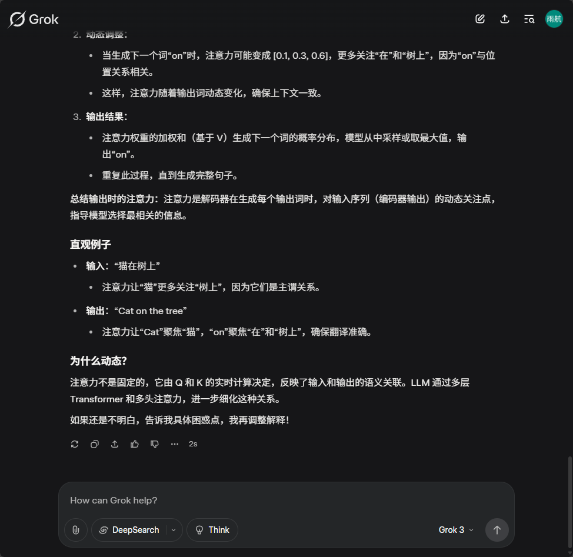

    

# 🌟 一个帮你从0到1学习LLM的课程（史无前例详细，听说学了就能中顶会拿大厂Offer）

---

## 📘 课程简介

**大模型的基础架构：** 包括 分词、词嵌入、位置编码、注意力机制、前馈网络、掩码、标准化、Encoder vs. Decoder、解码技术等。课程内容将从基础技术开始，逐步深入到高级技术，帮助你理解LLM的工作原理和应用。（更新中...）

**从0到1手搓一个大模型：** 从模型基础架构带你从零开始，手把手教你手搓一个简单基础的大模型，让你对LLM的工作原理有更深入的理解。（暂未完成）

**大模型的常用技术：** 包含预训练、微调、Prompt技术、RAG等常见技巧。（暂未完成） 

**上海Lab十佳项目：** 带你从开发者的角度，体验**上海lab十佳项目**的开发思路（已完成：[利用大模型进行图寻地址](https://github.com/VovyH/MultiAgent-Search)）
- 项目视频链接：

**论文介绍：** 本项目为了服务更多无资源无指导的本科生，提供顶会论文速读。（主要包括安全方向，更新中...）

---

## 📚 目录（快速定位你想要学习的内容）

| 章节           | 内容  |
|-------------------------|---------------------------|
| Tokenization   | 包含各种分词粒度的介绍，以及常见的分词算法讲解和对应代码实现（FMM、BMM、BPE、WordPiece等），包括与分词相关的常见问题|                    
| LLMs  | 关于从0到1自己手搓一个大模型、训练大模型的基础以及Prompt技术和RAG等 (更新中...)|              
| Project     | 上海Lab书生·浦语 十佳项目、优秀项目、高票项目学习（作者本人手搓-学习版本）(https://github.com/VovyH/MultiAgent-Search) |                   
| 词嵌入WordEmbedding     | 包括One-Hot编码、共现矩阵、Word2Vec等 |      

| 位置编码    | 包含常见的位置编码方法（正余弦周期函数、训练、RoPE等） |
| Attention    | LLM中Attention的几种计算方式（后续会更完整） |   
| LLM中的超参数    | 详细介绍了大模型中的几种超参数，以及他们的计算方法 |   

---

## 🔄 更新内容

更新日志

| 更新章节           | 具体内容 | 日期    | 
|-------------------------|---------------------------|------------|
| Tokenization   | 包含各种分词粒度的介绍，以及常见的分词算法讲解和对应代码实现                    | 2025.05.25 |
| Clip& UNet&Blip   | 关于Clip& UNet&Blip的简单介绍               | 2025.05.26 |
| Tokenization代码和文档的补充     | WordPiece 和 BPE代码补充，以及常见问题                    | 2025.05.27 |
| 词嵌入知识点     | 词嵌入的知识点，以及LLM中词嵌入的应用和相关代码                   | 2025.05.28 |
| 位置编码知识点     | 位置编码的常见技术（绝对位置编码、相对位置编码）                  | 2025.05.31 |
| Attention     |自注意力机制的相关内容                  | 2025.6.02 |
| 损失函数     |补充了一些关于损失的知识点                  | 2025.6.07 |
| LLM中的超参数    | 详细介绍了大模型中的几种超参数，以及他们的计算方法 | 2025.6.10 |

