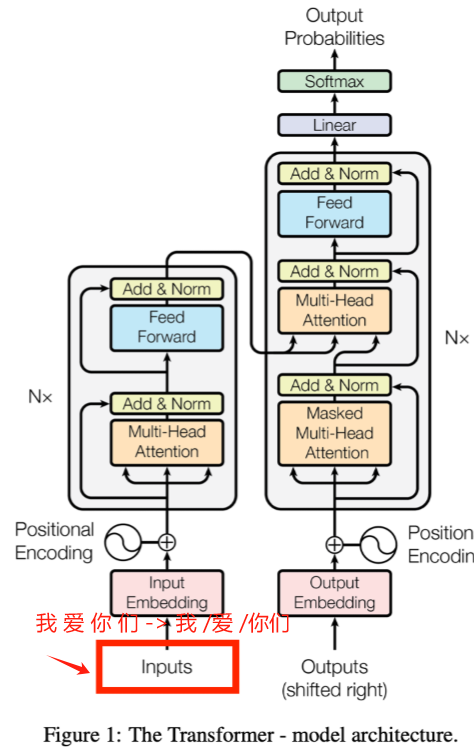

# Tokenization
## 1.为什么要进行分词？
自然语言文本大模型是不懂的，所以需要把文本分成离散的Id，能够映射到对应字典中的词语。
如红框所示，对inputs进行预处理：


## 2.分词的定义
Tokenization 是将一个整体(例如词、短语、句子、段落甚至语音、图像)分割成较小单位(被称为token)的过程。

## 3.分词的难点是什么？
分词是实体标注、词性标注任务的基础，分词后的准确度直接影定义:Tokenization 是将一个整体(例如词、短语、句子、段落甚至语音、图像)分割成较小单位(被称为token)的过程。响到后续的词性标注、语法分析、词向量登质量。问题如下：
1. 英语语句：一般都会用空格进行分割，除了部分名词短语（eg. “New York”可以本身作为分词后的词语也可以分词为“New”、“York”）
2. 中文语句：中文因为缺少天然的分隔符，需要读者自行断句，不然意思会不一样。所以做中文NLP任务时，需要先 Tokenization，难点主要集中在：

    - **分词标准不统一**：没有明确的分词标准。中文分词在实际应用中面临一致性问题：
        > 例如，"中华人民共和国”在某些任务中会被当作一个整体词语，而在另一些任务中则被拆解为“中华”、“人民”、"共和国”三个词。不同机构、不同领域对“词”的定义不一致，造成训练数据和测试数据之间存在偏差，影响模型泛化能力。

    - **切分歧义**：分为交集型歧义、真歧义、组合型歧义三种。
        > 1. `交集型歧义`：例如 “研究生的活动” 可以切为 “研究 生的活动”，也可以切为 “研究生的 活动”，二者语义不一致，但在不同的上下文中可能都合理。那么什么时候在任何上下文中都不合理呢？
        > 2. `组合型歧义`：例如“研究生活动“可以切为 “研究生 活动”(正确) 或 “研究 生活 动”(错误)，前者为名词短语，后者则失去了原意。
        > 3. `真歧义`：真歧义指的时无法通过规则轻易判断，需要结合上下文和实时库辅助判断，比如“今天天气不错”，既可以切为“今天 天气 不错”，也可以切为“今天天 气 不错”(如果“今天天”是专有名词，比如品牌名)。

    - **未登录词**：指的时新词涌现，即 OOV(Out-of-Vocabulary) 问题，词典中未收录的网络用词登。


## 4.基于词典的规则匹配算法（Word—Based）
基于词典的分词算法主要依赖于**预先构建的词典**，通过**字符串匹配**的方式将句子切分为词语。根据匹配策略的不同，主要分为以下几种方法：

### 4.1正向最大匹配算法（Forward Maximum Matching,FMM）
**原理：** 从左到右扫描句子，与词典匹配最长的词语，如果匹配成功则切分该词，否则，缩短词长继续匹配词语，重复直至整个句子切分完毕。
**代码：** 见 FMM.py

### 4.2逆向最大匹配算法（Backward Maximum Matching, BMM）
**原理：** 从右到左扫描句子，与词典匹配最长的词语，如果匹配成功则切分该词，否则，缩短词长继续匹配词语，重复直至整个句子切分完毕。
**代码：** 见 BMM.py

### 4.3双向匹配分词算法（Bidirectional Matching）
**原理：** 同时采用正向最大匹配和逆向最大匹配两种方法，对比两种分词结果，选
择词数较少者作为最终结果。（粒度更细）

### 4.4全切分路径选择算法（Full Path Selection）
**原理：** 枚举所有可能的切分路径，通过某种评价标准（如：词频、概率）选择最优的切分结果。
- 如何判断高频词？：高频词就是语言中 “被人用得多” 的词。按照语言模型的直觉:如果一个词在语料库中出现得越多，那么它在真实语境中出现的概率也越高。所以，词频越高的词，越应该被优先识别出来，比如 研究 /生命 /的 /起源 **(合理，常见搭配)**; 研究生/命/的/起源 **(不太合理)**。
**优点：** 这种基于词频的方式很好地缓解了 **组合型歧义** 问题，因为基于词库中频率高的词语进行分词能够模拟出现实的断句语境。

主要包括两种方法：
1. **N最短路径分词：** 每个句子将生成一个有向无环图, 每个字作为图的一个定点, 边代表可能的分词路径，路径上会标有权重，然后结合所有的分词路径，选择权值和最高的路径。最简单的做法是采用词频作为权值, 也可以采用TF-IDF值作为权值提高对低频词的分词准确度.


**代码：** 见 N-path.py

2. **基于N元语法模型的算法：** 在最短路径算法的基础上，考虑词与词之间的上下文关系。使用n元语法模型(如二元、三元)来评估切分路径的概率，通过最大化路径的概率来选择最优切分结果。问题来了，什么叫**n-gram**？
> **n-gram** 是一种简单而有效的语言模型，它认为:一个词出现的概率，可以由它前面的 n-1 个词决定。比如：
    1. 1-gram(unigram):只看词本身的频率 P(北京)。
    2. 2-gram(bigram): 当前词出现的概率，依赖于前一个词，比如 P(天安门|北京): 表示“北京“后面出现“天安门”的概率。
    3. 3-gram(trigram):当前词依赖于前两个词，P(讲话|国家主席,新年):表示“国家主席 新年”后，出现“讲话”的概率。
**代码：** 见 n-gram.py
**优点：** 
1. N最短路径分词算法通过遍历所有分词路径的权重和来选择最优分词路径，这种方式能够有效缓解**组合歧义**问题（类似于出现的越多，词越重要，按重要的分不太可能出现语义错误）。
2. n-gram 通过词与词之间的关系，能够有效的考虑上下文，因此在缓解组合歧义问题的同时，还能缓解**交叉型歧义**问题，更能基于上下文理解输入语义。


## 5.基于统计的机器学习方法
### 5.1 隐马尔可夫模型(HMM)
**原理：** HMM 是一种统计模型，适用于处理序列数据。在分词中，HMM 将每个字标注为B(词首)、M(词中)、E(词尾)、S(单字词)中的一种，通过概率模型来**预测最可能的标注序列**。
**核心思想：** 当前状态只依赖于前一个状态（马尔可夫性质），观测值则依赖于当前状态。

此刻由于疫情，你无法与你喜欢的plmm约会，你只能盯着手机屏幕来了解她最近的生活，等着喜欢的人每天更新她的朋友圈：“今天是开心的一天”，“今天不开心”，“最近水逆啊”等等。而导致她发出这条动态则可能是她今天陪闺蜜逛街，她今天搞了一天学习，她今天农药晋级赛又跪了ORZ等等。那么，每一天就是一个时刻，女神的朋友圈每一条状态（开心，不开心，水逆等）是你可观测到的，这就是`观测序列`。而她导致她发朋友圈的原因（逛街，学习，游戏）等，因为疫情隔离在家，你无法窥探到，这便是`不可观测的状态序列`。因此HMM由**两个要素**构成：
1. 隐含状态序列。
2. 观测序列。
**公式：**
使用贝叶斯公式计算给定观测序列`O`，最可能的状态序列`Q`：

其中，Q 是状态序列，0是观测序列，P(Q|O)是给定观测序列条件下，状态序列Q的概率。
**代码：** 见 HMM.py

## 6.分词的粒度
以最新的视角来看分词算法，根据拆分的粒度不同，Tokenization主要分为三种类型:**词粒度(Word-based)**、**子词粒度(Subword-based)**和**字符粒度(Character-based)**。每种粒度在不同的应用场景中具有各自的优缺点，尤其是在处理中文等没有天然分隔符的语言时，选择合适的粒度尤为重更
```python
Let us learn tokenization
Word-based:[“let”,“us”,“learn”,“tokenization”]
Subword-based:[“let”,“us”,“learn”,“token”,“ization”]
Character-based:[“l”,“e”,“t”,“......”,“i” “o” “n”]
```

### 6.1 Word-Based分词
词级Tokenizer将文本拆分为独立的词语，是最自然的语言单元。对于英语等有空格或标点符号作为天然分隔符的语言，词级分词相对容易实现。
**优点：** 语义清晰，能够很好地表述词汇语义，因此对很多NLP任务来说 Word-Based 效果会很好。
**缺点：** 词典规模很大，由于中文缺乏天然的分隔符，需要依赖分词算法，而词汇表容易出现长尾现象，导致词汇表很大；另外会出现未登录现象，即OOV。
**什么是长尾效应：** 指在语言模型的分词过程中，词表中包含了很多不常见的词汇，这些词汇虽然数量众多，但使用频率极低。这种现象导致词表变得非常庞大，增加了存储和训练的成本。
**OOV：** 词粒度分词模型只能处理词表中的词汇，对于词表之外的词汇（OOV，Out-of-Vocabulary）无法进行有效处理。这限制了模型的泛化能力，尤其是在处理新词或罕见词时，模型表现不佳。（这对于未来不常见的问题处理可能效果会不好）

### 6.2 字符粒度(Character-based)分词
字符级Tokenization将文本拆分为单个字符，是最基本的拆分单元。对于英语，每个字母或标点符号都是独立的字符;对于中文，每个汉字也是一个字符；
**优点：** 规模小，很适合处理未登录词，即新词，有利于未登录词问题的解决。
**缺点：** 语义表达能力弱，单个字符难以承载丰富的语义信息，模型需要通过组合多个字符来理解词义，增加了学习难度。其次相比于词分级，字符分级会增加序列长度，计算负担也会大很多。

### 6.3 子词粒度（Subword）
将词语拆分为更小的子单位，如词根、前缀、后缀等。常见的方法包括`BPE(Byte Pair Encoding)`、`WordPiece` 和 `Unigram`。
**优点：** 有利于平衡词汇表大小和语义表达，通过将罕见词拆分为子词，可以有效减少词汇表的规模，同时保留词语的语义信息；其次，子词级方法能够自然地处理新词和复合词，通过组合已存在的子词表示新词，缓解未登录词问题。
**缺点:** 子词边界模糊，拆分后的子词可能失去部分语义信息，尤其是对于语素丰富的语言(如中文)（注：但比字符粒度好很多了）。

***问题：LLM中使用什么分词技术呢？**
> `不使用Word-Based（HMM等）`：长尾效应和 OOV 不适合LLM，另外是这些方法不具有一个固定词表，导致没有一个确定性的映射。为什么LLM要确定性的映射呢? 因为词在编码(tokenization)之后还要解码(detokenization)，因此必须要一个可逆的过程，类似函数和反函数!
> `不使用字符粒度(Character-based)分词`：字符粒度最重要的点是解决了OOV问题，但是也存在明显缺点，比如，语义信息不明确:字符粒度分词无法直接表达词的语义，可能导致在一些语义分析任务中效果较差；处理效率低:由于文本被拆分为字符，处理的粒度较小，增加后续处理的计算成本和时间。

#### 6.3.1 BPE(Byte-Pair Encoding)
BPE是一种数据压缩技术，核心思想是通过迭代地将最常见的一对连续字节（byte pair）替换为一个新的未使用字节（new byte），从而实现压缩。
**算法流程：**
1. 计算初始词表: 先把训练语料分成最小单元 (英文中26个字母加上各种符号以及常见中文字符)，这些作为初始词表。
2. 构建频率统计: 统计所有子词单元对(bigram，即两个连续的子词)在文本中的出现频率，
3. 合并频率最高的子词对: 合并出现频率最高的子词对，并更新词汇表和merge rule.
4. 重复合并步骤: 不断重复步骤 2和步骤3，直到达到预定的词汇表大小，合并次数，或者直到不再有有意义的合并(即，进一步合并不会显著提高词汇表的效益)
5. 分词: 使用最终得到的merge rule对文本进行分词。

**代码：** 见 BPE.py

#### 6.3.1 WordPiece
WordPiece核心思想是将单词拆分成多个前缀符号(比如BERT中的##)最小单元，再通过子词合并规则将最小单元进行合并为子词级别。例如对于单词"word"，拆分如下:
```python
W ## o ## r ##d
```
**算法过程如下：**
1. 计算初始词表：通过训练语料获得或者最初的英文中26个字母加上各种符号以及常见中文字符，这些作为初始词表。
2. 计算合并分数(PMI)：对训练语料拆分的多个子词单元通过合拼规则计算合并分数.
3. 合并分数最高的子词对：选择分数最高的子词对，将它们合并成一个新的子词单元，并更新词表
4. 重复合并步骤：不断重复步骤 2 和步骤 3，直到达到预定的词表大4.小、合并次数，或者直到不再有有意义的合并(即，进一步合并不会显著提高词表的效益)。
5. 分词：使用最终得到的词汇表对文本进行分词(注意是利用词汇表对比BPE)。
**代码：** 见 WordPiece.py
