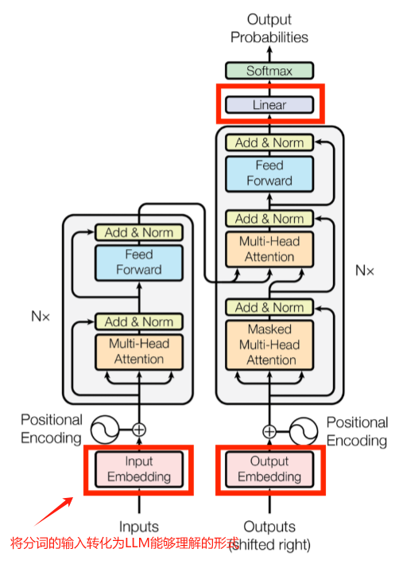
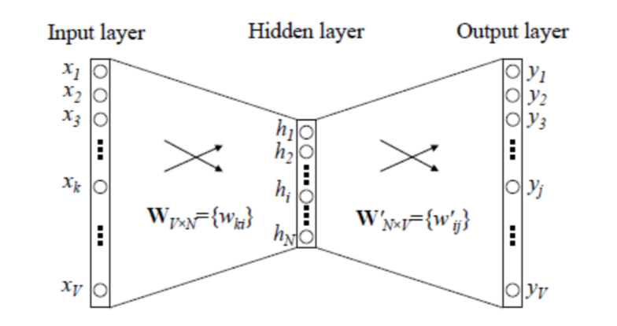
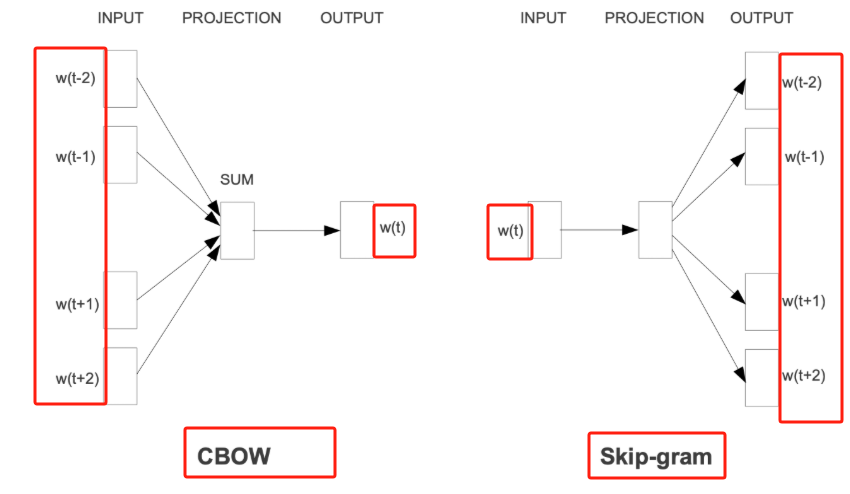
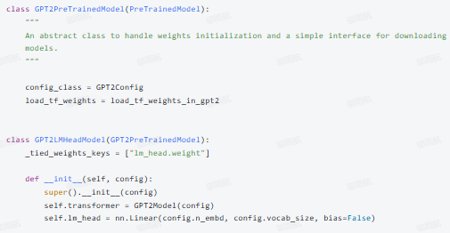

# 词嵌入 Word Embedding 
## 1.介绍
要让 transformer 模型理解每一个token(离散id)，需要把词语转化为具有语义的向量(embedding)这一部分的技术主要是指Vocab的Embedding化:

词嵌入(Word Embedding)是自然语言处理(NLP)中的关键技术，用于将离散的词汇映射到连续的向量空间,使得语义相近的词在向量空间中彼此接近。——>（也就是说维度越高，特征越丰富4，语义区分越明显）

## 2.One-Hot 编码
在NLP的早期阶段，0ne-Hot编码 是一种常用的词表示方法。每个词被表示为一个**长度为词汇表大小**的向量，其中对应词的位置为1，其余位置为0.例如，假设词汇表包含以下词汇:

apple：[1, 0, 0, 0, 0]
banana：[0, 1, 0, 0, 0]
cherry：[0, 0, 1, 0, 0]

**优点：** 简洁，能够在表示词汇表中的所有词汇的同时有较强的区分程度。
**缺点：**
1. 高维稀疏性：随着词汇表的增大，向量维度也随之增加，导致数据稀疏，计算效率低下。（向量中有很多的0是无需被重复计算的，只需要计算有1的地方即可）
2. 无法捕捉语义关系:不同词的0ne-Hot向量彼此正交（相乘一定为0），无法反映词与词之间的语义相似性。

## 3.共现矩阵（Co-occurence Matrix）的表示
通过统计词汇在一定窗口内的共现频率，构建词与词之间的关联矩阵。
假设有以下句子:

```python
I like NLP.
I like deep learning.
I enjoy flying.
```
可以构建以下共现矩阵：

|   | 1  | like | enjoy | NLP | deep | learning | flying |
|---|----|------|-------|-----|------|----------|--------|
| 1 | 0  | 2    | 1     | 1   | 1    | 1        | 1      |
| like | 2  | 0    | 0     | 1   | 1    | 1        | 0      |
| enjoy | 1  | 0    | 0     | 0   | 0    | 0        | 1      |
| NLP | 1  | 1    | 0     | 0   | 0    | 0        | 0      |
| deep | 1  | 1    | 0     | 0   | 0    | 1        | 0      |
| learning | 1  | 1    | 0     | 0   | 1    | 0        | 0      |
| flying | 1  | 0    | 1     | 0   | 0    | 0        | 0      |

可以发现共现矩阵能够构建词与词的关联，但复杂语义就很难捕捉了，比如我喜欢打游戏、我喜欢唱歌来自两个不同的句子，之间的名词关联就比较难捕捉到了（具体情况会更复杂）；其次也存在高维稀疏性的问题（根据词量来算的矩阵大小），增添了很多不必要的计算。(依赖窗口大小)

## 4.分布词的表示（Distributed Word Representation）
### 4.1 Word2Vec
2013年，Go0gle提出了Word2Vec模型，Word2Vec 的训练模型本质上是只**具有一个隐含层**的神经元网络：


它的输入是采用 0ne-Hot 编码的词汇表向量，它的输出也是 0ne-Hot 编码的词汇表向量。

使用所有的样本，训练这个神经元网络，等到收敛之后，从输入层到隐含层的那些权重，便是每一个词的采用Distributed Representation的词向量。比如，上图中单词的Word embedding后的向量便是矩阵 Wx~ 的第i行的转置。这样就把原本维数为 V 的词向量变成了维数为 N 的词向量(N远小于V)，并且词向量间保留了一定的相关关系。

**Word2Vec**包含连续词袋模型（CBOW）和跳字模型（Skip-gram）两种架构，其中**CBOW**在大型语料库的表现会更好，**Skip-gram**只适合小型语料库。
- **CBOW：** 通过上下文预测中心词，其中CBOW如下图所示，使用中心词周围的其他词（语境）作为输入，在映射层做加权处理后输出目标单词。
    > 具体措施：将上下文词的 One-Hot 编码向量进行加权平均，然后将加权平均后的向量输入到隐藏层中，最后经过输出层预测中心词。

- **Skip-gram：** 通过中心词预测上下文。Skip-gram根据当前单词预测语境，如下图右部分所示。
    >具体措施： 将中心词的 One-Hot 编码向量输入到神经网络中，通过隐藏层得到词向量，最后通过输出层预测上下文词。

假如有一个句子"There is an apple on the table"作为训练数据。
CBOW的输入为(is,an,on,the)，输出为apple。
Skip-gram的输入为apple，输出为(is,an,on,the)。


## 5.其他词表示
### 5.1 GloVe(了解)
2014年，斯坦福大学提出了GloVe(Global Vectors for Word Representation)模型。Glove通过对全局词共现矩阵进行矩阵分解，学习词的向量表示，能够更好地捕捉全局的语义信息。

### 5.2 FastText(了解)
Facebook提出的FastText模型考虑了词的内部结构(如字符n-gram)，能够处理未登录词和拼写错误的词汇，提升了模型的泛化能力。（跟CBOW很像，但主要用作分类）

### 5.3 ELMO(了解)
ELMo (Embeddinas from Lanquage Models)基于双向LSTM，通过预训练语言模型，为每个词生成上下文相关的向量表示，即同一个词在不同上下文中有不同的表示。
### 5.4 BERT
BERT (Bidirectional Encoder Representations from Transformers)基于Transformer架构，属于大语言模型(之后会详细介绍)。其采用双向编码器，能够更深入地理解上下文信息。

## 6. LLM中的词嵌入
大语言模型(LLM)中的词嵌入解决的仍然是离散词(更准确的说，是token id)到一个vector的映射问题，但是LLM不使用以上任何一种任务进行训练，而是直接通过加入nn.Embedding进行词嵌入训练：


**为什么要用词嵌入共享：** 
在许多NLP任务中，模型需要将文本数据转换成向量形式，然后再从这些向量预测出文本数据。例如，在语言模型中，模型需要根据给定的文本序列预测下一个词。这里，输入和输出都是词汇表中的词。（包含词->输入向量，输出向量->词）

如果不使用词嵌入共享，模型将需要两个独立的嵌入矩阵：一个用于将输入词转换为向量（输入嵌入），另一个用于将向量转换回词（输出嵌入）。这不仅增加了模型的参数数量。因此，在实现词嵌入共享时，模型的**输入嵌入层**和**输出嵌入层**使用相同的权重矩阵。
- 输入嵌入：当模型接收输入文本时，输入词通过嵌入层转换成向量表示。
- 输出嵌入：当模型生成输出时，输出层（通常是一个线性层或softmax层）使用相同的嵌入权重矩阵将向量转换回词。

代码：embed.py，展示了词嵌入的重要性。(请注册硅基流动API Key)